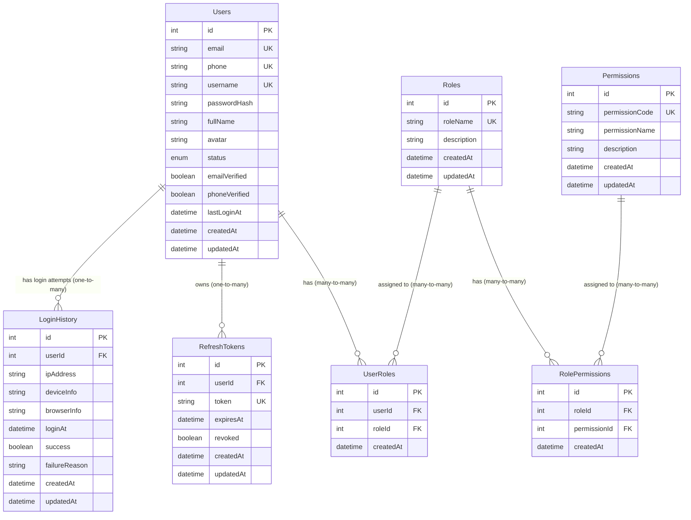

# VIXXY D'ORANCE Authentication Database - ERD Diagram

```mermaid
erDiagram
    Users ||--o{ UserRoles : "has (many-to-many)"
    Roles ||--o{ UserRoles : "assigned to (many-to-many)"
    Roles ||--o{ RolePermissions : "has (many-to-many)"
    Permissions ||--o{ RolePermissions : "assigned to (many-to-many)"
    Users ||--o{ RefreshTokens : "owns (one-to-many)"
    Users ||--o{ LoginHistory : "has login attempts (one-to-many)"
    
    Users {
        int id PK
        string email UK
        string phone UK
        string username UK
        string passwordHash
        string fullName
        string avatar
        enum status
        boolean emailVerified
        boolean phoneVerified
        datetime lastLoginAt
        datetime createdAt
        datetime updatedAt
    }
    
    Roles {
        int id PK
        string roleName UK
        string description
        datetime createdAt
        datetime updatedAt
    }
    
    Permissions {
        int id PK
        string permissionCode UK
        string permissionName
        string description
        datetime createdAt
        datetime updatedAt
    }
    
    UserRoles {
        int id PK
        int userId FK
        int roleId FK
        datetime createdAt
    }
    
    RolePermissions {
        int id PK
        int roleId FK
        int permissionId FK
        datetime createdAt
    }
    
    RefreshTokens {
        int id PK
        int userId FK
        string token UK
        datetime expiresAt
        boolean revoked
        datetime createdAt
        datetime updatedAt
    }
    
    LoginHistory {
        int id PK
        int userId FK
        string ipAddress
        string deviceInfo
        string browserInfo
        datetime loginAt
        boolean success
        string failureReason
        datetime createdAt
        datetime updatedAt
    }
```
