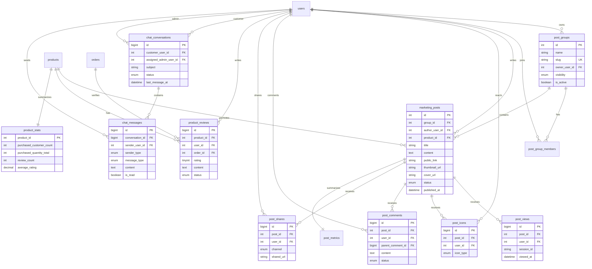

# Lab 8: E-Marketing ERD

```mermaid
erDiagram
    users ||--o{ post_groups : owns
    users ||--o{ post_group_members : joins
    post_groups ||--o{ post_group_members : has
    post_groups ||--o{ marketing_posts : contains
    users ||--o{ marketing_posts : writes
    products ||--o{ marketing_posts : promotes

    marketing_posts ||--o{ post_views : receives
    marketing_posts ||--o{ post_icons : receives
    marketing_posts ||--o{ post_comments : receives
    marketing_posts ||--o{ post_shares : receives
    marketing_posts ||--|| post_metrics : summarizes
    users ||--o{ post_icons : reacts
    users ||--o{ post_comments : comments
    users ||--o{ post_shares : shares

    products ||--o{ product_reviews : has
    products ||--|| product_stats : summarizes
    users ||--o{ product_reviews : writes
    orders ||--o{ product_reviews : verifies

    users ||--o{ chat_conversations : customer
    users ||--o{ chat_conversations : admin
    chat_conversations ||--o{ chat_messages : contains
    users ||--o{ chat_messages : sends

    post_groups {
        int id PK
        string name
        string slug UK
        int owner_user_id FK
        enum visibility
        boolean is_active
    }

    marketing_posts {
        int id PK
        int group_id FK
        int author_user_id FK
        int product_id FK
        string title
        text content
        string public_link
        string thumbnail_url
        string cover_url
        enum status
        datetime published_at
    }

    post_views {
        bigint id PK
        int post_id FK
        int user_id FK
        string session_id
        datetime viewed_at
    }

    post_icons {
        bigint id PK
        int post_id FK
        int user_id FK
        enum icon_type
    }

    post_comments {
        bigint id PK
        int post_id FK
        int user_id FK
        bigint parent_comment_id FK
        text content
        enum status
    }

    post_shares {
        bigint id PK
        int post_id FK
        int user_id FK
        enum channel
        string shared_url
    }

    product_reviews {
        bigint id PK
        int product_id FK
        int user_id FK
        int order_id FK
        tinyint rating
        text content
        enum status
    }

    product_stats {
        int product_id PK
        int purchased_customer_count
        int purchased_quantity_total
        int review_count
        decimal average_rating
    }

    chat_conversations {
        bigint id PK
        int customer_user_id FK
        int assigned_admin_user_id FK
        string subject
        enum status
        datetime last_message_at
    }

    chat_messages {
        bigint id PK
        bigint conversation_id FK
        int sender_user_id FK
        enum sender_type
        enum message_type
        text content
        boolean is_read
    }
```
