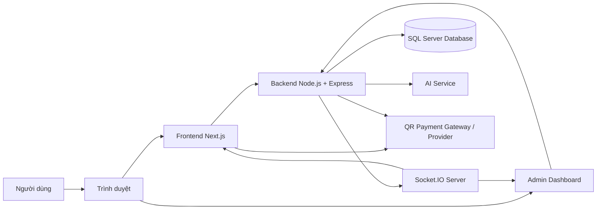
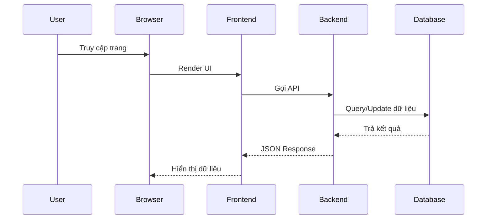
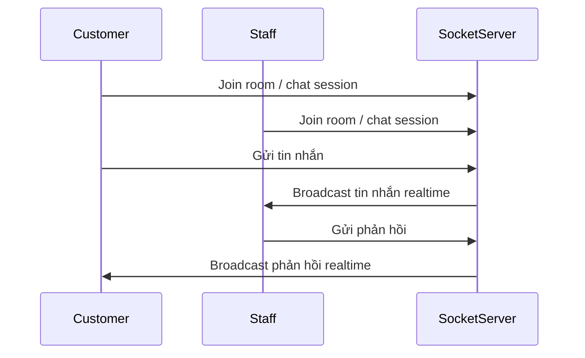
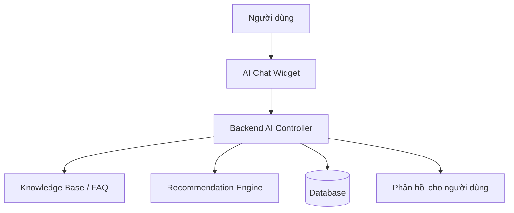
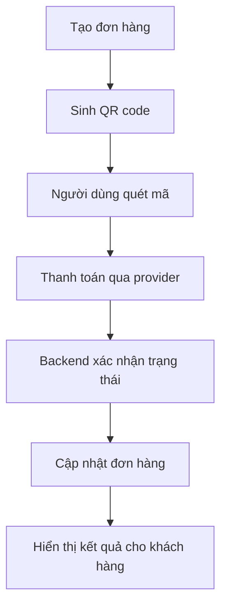
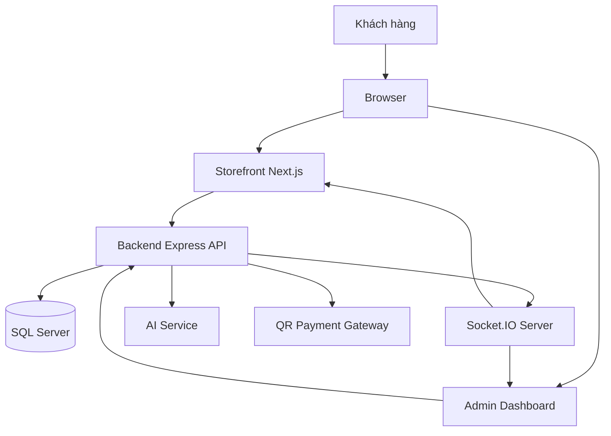

# Hướng dẫn Deployment - VIXXY D'ORANCE

## 1. Giới thiệu

### 1.1 Tên dự án
VIXXY D'ORANCE là hệ thống thương mại điện tử thời trang được xây dựng theo mô hình monorepo, bao gồm:
- Frontend storefront bằng Next.js
- Admin dashboard bằng React/Vite
- Backend API bằng Node.js + Express
- Realtime chat và thông báo bằng Socket.IO
- AI chat/recommendation và thanh toán QR

### 1.2 Mục tiêu
Tài liệu này nhằm cung cấp hướng dẫn triển khai đầy đủ dự án VIXXY D'ORANCE từ môi trường phát triển local đến môi trường production, bao gồm:
- Cài đặt môi trường
- Cấu hình biến môi trường
- Khởi động database
- Chạy backend, frontend, admin
- Triển khai lên Vercel/Render
- Kiểm tra hoạt động sau khi deploy

### 1.3 Kiến trúc hệ thống
Hệ thống gồm các thành phần chính sau:
- Người dùng truy cập qua trình duyệt
- Frontend storefront hiển thị sản phẩm, giỏ hàng, thanh toán
- Admin dashboard quản trị sản phẩm, đơn hàng, chat, review
- Backend API xử lý nghiệp vụ và kết nối database
- Socket.IO Server phục vụ realtime chat và cập nhật trạng thái
- SQL Server lưu trữ dữ liệu chính
- AI Service hỗ trợ chat, gợi ý sản phẩm và phân tích bán hàng
- QR Payment tích hợp cho quy trình thanh toán

### 1.4 Công nghệ sử dụng
- Frontend: Next.js, React, TypeScript, Tailwind CSS
- Admin: React, Vite, TypeScript, Tailwind CSS
- Backend: Node.js, Express, TypeScript
- Realtime: Socket.IO
- Database: SQL Server, Prisma, Sequelize
- Testing: Jest, Supertest
- Deployment: Vercel, Render, Git
- AI: AI chat/recommendation service và knowledge base

---

## 2. Kiến trúc Deployment

### 2.1 Deployment Diagram



### 2.2 Mô tả luồng hoạt động

1. Người dùng truy cập storefront qua trình duyệt.
2. Frontend gửi request đến Backend API để lấy sản phẩm, giỏ hàng, đơn hàng, review.
3. Backend kết nối với SQL Server để đọc/ghi dữ liệu.
4. Khi có tương tác realtime như chat hoặc cập nhật trạng thái thanh toán, Socket.IO sẽ truyền dữ liệu đến frontend và admin.
5. Admin dashboard nhận dữ liệu realtime và có thể xử lý chat, đơn hàng, đánh giá.
6. AI Service hỗ trợ gợi ý sản phẩm và trả lời câu hỏi khách hàng.
7. QR Payment tạo mã QR cho đơn hàng, người dùng quét mã và backend xác nhận thanh toán.

### 2.3 Luồng Request/Response



### 2.4 Luồng Socket.IO



### 2.5 Luồng AI Chat



### 2.6 Luồng QR Payment



---

## 3. Yêu cầu môi trường

### 3.1 Phần mềm cần cài đặt
- Node.js 18.x hoặc mới hơn
- npm hoặc pnpm (dự án hiện dùng npm)
- Git
- SQL Server 2019+ hoặc SQL Server trên cloud
- VS Code
- Vercel CLI (nếu deploy frontend)
- Render CLI hoặc tài khoản Render (nếu deploy backend)

### 3.2 Khuyến nghị cấu hình máy phát triển
- RAM: tối thiểu 8 GB
- CPU: 4 lõi trở lên
- ổ đĩa trống ít nhất 10 GB
- kết nối Internet ổn định để cài package và deploy

---

## 4. Cấu trúc thư mục

### 4.1 Thư mục backend
Chứa toàn bộ API, service, controller, middleware, model, route và cấu hình cho server.
- Xử lý auth, user, product, cart, order, payment
- Quản lý Socket.IO
- Kết nối database
- Cấu hình môi trường và deploy

### 4.2 Thư mục vixxy-store
Thư mục frontend chính của storefront bằng Next.js.
- Trang sản phẩm, giỏ hàng, checkout
- Thanh toán, wishlist, bài viết, hồ sơ khách hàng
- Kết nối API và Socket.IO

### 4.3 Thư mục admin hoặc admin-dashboard
Thư mục admin dashboard để quản lý hệ thống.
- Quản lý sản phẩm, đơn hàng, chat, review, người dùng
- Truy cập realtime và dashboard analytics

### 4.4 Thư mục prisma
Chứa schema Prisma và file seed dùng cho migration/database bootstrap.
- Quản lý model dữ liệu
- Sinh client Prisma
- Tạo dữ liệu mẫu

### 4.5 Thư mục docs
Chứa tài liệu kỹ thuật, môi trường, triển khai và database design.
- ENVIRONMENT_VARIABLES.md
- PRODUCTION_GUIDE.md
- DEPLOYMENT_GUIDE.md (tài liệu hiện tại)

### 4.6 Thư mục images
Chứa tài nguyên hình ảnh dùng trong hệ thống.
- Ảnh sản phẩm
- Ảnh banner
- Tài nguyên UI

### 4.7 Thư mục novachat
Thư mục dành cho mô-đun hoặc demo chat/AI có thể dùng cho thử nghiệm hoặc tích hợp riêng.

---

## 5. Clone dự án

### 5.1 Clone repository
```bash
git clone <repository-url>
cd vixxy-fashion
```

### 5.2 Cài đặt dependencies
```bash
cd backend
npm install

cd ../vixxy-store
npm install

cd ../admin
npm install
```

> Nếu dự án đang dùng thư mục cũ là admin-dashboard, thay bằng lệnh tương ứng.

---

## 6. Cấu hình Environment Variables

### 6.1 Biến môi trường backend
Các biến quan trọng cần cấu hình cho backend:

- DATABASE_URL: chuỗi kết nối database
- JWT_SECRET: secret cho access token
- REFRESH_TOKEN_SECRET: secret cho refresh token
- SOCKET_PORT: cổng Socket.IO
- API_URL: URL backend API công khai
- FRONTEND_URL: URL storefront
- BACKEND_URL: URL backend
- AI_API_KEY: key cho AI service nếu có tích hợp

Ví dụ cấu hình mẫu:

```env
NODE_ENV=development
PORT=3003
DATABASE_URL=Server=localhost;Database=vixxy_db;User Id=sa;Password=YourPassword;TrustServerCertificate=true;
JWT_SECRET=your_jwt_secret
REFRESH_TOKEN_SECRET=your_refresh_secret
SOCKET_PORT=3003
API_URL=http://localhost:3003/api
FRONTEND_URL=http://localhost:3000
BACKEND_URL=http://localhost:3003
AI_API_KEY=
```

### 6.2 Biến môi trường frontend
```env
NEXT_PUBLIC_API_URL=http://localhost:3003/api
NEXT_PUBLIC_SOCKET_URL=http://localhost:3003
NEXT_PUBLIC_BASE_URL=http://localhost:3000
NEXT_PUBLIC_ADMIN_URL=http://localhost:3001
```

### 6.3 Biến môi trường admin
```env
VITE_API_URL=http://localhost:3003/api
VITE_SOCKET_URL=http://localhost:3003
VITE_STORE_URL=http://localhost:3000
```

> Không nên commit file .env vào Git. Hãy giữ riêng cho môi trường phát triển và production.

---

## 7. Khởi động Database

### 7.1 Tạo database trên SQL Server
1. Mở SQL Server Management Studio
2. Tạo database mới, ví dụ: `vixxy_db`
3. Đảm bảo tài khoản đăng nhập có quyền tạo bảng và thực thi script

### 7.2 Sử dụng schema có sẵn
Trong thư mục [docs/04-database-design](../docs/04-database-design) có các file schema SQL Server, có thể dùng làm tài liệu khởi tạo dữ liệu ban đầu.

### 7.3 Prisma Generate
```bash
cd backend
npx prisma generate
```

### 7.4 Prisma Migrate hoặc db push
Nếu dùng Prisma trong môi trường phát triển:
```bash
npx prisma migrate dev --name init
```

Nếu dùng cách nhanh hơn cho môi trường thử nghiệm:
```bash
npx prisma db push
```

### 7.5 Seed dữ liệu ban đầu
```bash
npm run prisma:seed
```

> Nếu không có seed hoặc dữ liệu mẫu, có thể bỏ qua bước này và tạo tài khoản/admin thủ công.

---

## 8. Chạy Backend

### 8.1 Di chuyển vào thư mục backend
```bash
cd backend
```

### 8.2 Cài đặt dependency
```bash
npm install
```

### 8.3 Chạy ở môi trường phát triển
```bash
npm run dev
```

### 8.4 Giải thích từng lệnh
- `npm install`: cài toàn bộ package cần thiết
- `npm run dev`: khởi động backend bằng tsx watch, hỗ trợ hot reload
- `npm run build`: compile TypeScript sang thư mục build/dist
- `npm start`: chạy ứng dụng build sẵn

### 8.5 Port mặc định
Backend thường chạy tại:
- `http://localhost:3003`

### 8.6 Kiểm tra backend
```bash
curl http://localhost:3003/health
```

---

## 9. Chạy Frontend

### 9.1 Di chuyển vào thư mục storefront
```bash
cd vixxy-store
```

### 9.2 Cài đặt dependency
```bash
npm install
```

### 9.3 Khởi động dev server
```bash
npm run dev
```

### 9.4 Port mặc định
Frontend thường chạy tại:
- `http://localhost:3000`

### 9.5 Kiểm tra storefront
Mở trình duyệt và truy cập:
- `http://localhost:3000`

---

## 10. Chạy Admin Dashboard

### 10.1 Di chuyển vào thư mục admin
```bash
cd admin
```

> Nếu repo đang dùng thư mục cũ là admin-dashboard thì thay bằng tên thư mục đó.

### 10.2 Cài đặt dependency
```bash
npm install
```

### 10.3 Khởi động dev server
```bash
npm run dev
```

### 10.4 Port mặc định
Admin thường chạy tại:
- `http://localhost:3001`

---

## 11. Socket.IO

### 11.1 Vai trò của Socket.IO
Socket.IO dùng để xử lý:
- Realtime chat giữa khách hàng và quản trị viên
- Cập nhật trạng thái đơn hàng
- Thông báo sự kiện mới
- Dashboard realtime

### 11.2 Cách khởi động
Socket.IO được khởi động cùng backend khi chạy `npm run dev`.

### 11.3 Port và kết nối
- Backend thường lắng nghe trên cổng `3003`
- Frontend/admin kết nối đến backend qua URL Socket tương ứng

### 11.4 Room và session
- Mỗi phòng chat/session có thể được nhóm theo `roomId` hoặc `conversationId`
- Khi người dùng tham gia session, backend sẽ broadcast tin nhắn và trạng thái

### 11.5 Realtime chat
- Khách hàng gửi tin nhắn
- Backend phát đến staff/admin
- Admin phản hồi và broadcast ngược lại

---

## 12. AI Chat

### 12.1 AI Recommendation
Hệ thống có hỗ trợ gợi ý sản phẩm dựa trên hành vi người dùng và dữ liệu sản phẩm.

### 12.2 AI Sales
AI Sales phục vụ các luồng bán hàng thông minh, theo dõi tương tác và gợi ý hành động phù hợp.

### 12.3 AI Knowledge
AI knowledge base dùng để lưu trữ FAQ, nội dung hỗ trợ, câu hỏi thường gặp và phục vụ trả lời tự động.

### 12.4 AI Session
Mỗi phiên trò chuyện có thể được ghi nhận để theo dõi trạng thái, hành động và ngữ cảnh.

### 12.5 Cấu hình AI
Nếu có tích hợp API AI bên ngoài, cần thêm biến môi trường như:
- AI_API_KEY
- GEMINI_API_KEY
- OPENROUTER_API_KEY

> Nếu không cấu hình, hệ thống có thể hoạt động ở mức cơ bản bằng logic nội bộ hoặc FAQ.

---

## 13. QR Payment

### 13.1 Quy trình thanh toán QR
1. Khách hàng chọn sản phẩm và tạo đơn hàng.
2. Backend tạo payment record và sinh mã QR.
3. Người dùng quét mã QR bằng app ngân hàng hoặc ví điện tử.
4. Provider xác nhận giao dịch.
5. Backend nhận callback và cập nhật trạng thái thanh toán.
6. Hệ thống cập nhật đơn hàng sang trạng thái đã thanh toán hoặc chờ xác nhận.

### 13.2 Lưu ý khi triển khai
- Cần cấu hình đúng URL callback
- Cần bảo mật secret/key của gateway
- Nên test trong môi trường sandbox trước khi dùng production

---

## 14. Deployment

### 14.1 Frontend deployment lên Vercel

#### Bước 1: Chuẩn bị repository
- Đảm bảo code đã push lên GitHub
- Chọn thư mục triển khai là [vixxy-store](../vixxy-store)

#### Bước 2: Tạo project trên Vercel
1. Truy cập Vercel
2. Chọn Import Project
3. Chọn repository chứa dự án
4. Chọn Root Directory là `vixxy-store`
5. Framework được tự nhận là Next.js

#### Bước 3: Cấu hình Environment Variables
```env
NEXT_PUBLIC_BASE_URL=https://your-domain.vercel.app
NEXT_PUBLIC_API_URL=https://your-backend-url/api
NEXT_PUBLIC_SOCKET_URL=https://your-backend-url
NEXT_PUBLIC_ADMIN_URL=https://your-admin-domain.vercel.app
```

#### Bước 4: Build và deploy
Vercel tự chạy build command:
```bash
npm run build
```

#### Bước 5: Domain
Sau khi deploy thành công, Vercel sẽ cung cấp domain mặc định. Bạn có thể cấu hình custom domain riêng.

### 14.2 Backend deployment lên Render

#### Bước 1: Tạo Web Service trên Render
1. Truy cập Render
2. Chọn New → Web Service
3. Kết nối GitHub repository
4. Chọn thư mục backend

#### Bước 2: Build Command
```bash
npm install && npm run build:prod
```

#### Bước 3: Start Command
```bash
npm run start:prod
```

#### Bước 4: Environment Variables
```env
NODE_ENV=production
PORT=10000
DATABASE_URL=Server=...;Database=...;User Id=...;Password=...;TrustServerCertificate=true;
JWT_SECRET=your_secret
REFRESH_TOKEN_SECRET=your_refresh_secret
FRONTEND_URL=https://your-frontend-domain.vercel.app
BACKEND_URL=https://your-backend-url.onrender.com
ADMIN_URL=https://your-admin-domain.vercel.app
CORS_ORIGINS=https://your-frontend-domain.vercel.app,https://your-admin-domain.vercel.app
```

#### Bước 5: Deploy
Render sẽ build và chạy backend tự động. Sau khi deploy thành công, kiểm tra health endpoint.

### 14.3 Database deployment

#### SQL Server
- Có thể dùng SQL Server local hoặc Azure SQL
- Cần mở firewall cho IP deployer hoặc dùng managed database service
- Khuyến nghị tạo database riêng cho production

#### Chuỗi kết nối
Ví dụ:
```env
DATABASE_URL=Server=your-sql-server;Database=vixxy_db;User Id=your_user;Password=your_password;TrustServerCertificate=true;
```

#### Backup
- Thiết lập backup định kỳ
- Sao lưu schema và dữ liệu trước mỗi bản release quan trọng

---

## 15. Kiểm tra sau khi Deploy

### 15.1 Checklist chức năng
Sau khi deploy, cần kiểm tra các tính năng chính:
- Đăng ký
- Đăng nhập
- Xem sản phẩm
- Thêm vào giỏ hàng
- Thanh toán
- QR Payment
- Chat realtime
- Review sản phẩm
- Admin dashboard
- AI chat

### 15.2 Kiểm tra API
- Backend health endpoint hoạt động
- Frontend gọi API thành công
- CORS không bị lỗi
- Socket.IO kết nối ổn định

---

## 16. Xử lý lỗi thường gặp

| Lỗi | Nguyên nhân | Cách khắc phục |
|---|---|---|
| 404 trên Vercel | Route không được cấu hình đúng hoặc build thất bại | Kiểm tra log build, kiểm tra file routing, redeploy |
| CORS error | Origin không nằm trong danh sách CORS | Cập nhật FRONTEND_URL, ADMIN_URL, CORS_ORIGINS và redeploy backend |
| API không kết nối | Backend chưa chạy hoặc URL sai | Kiểm tra NEXT_PUBLIC_API_URL / VITE_API_URL |
| Socket.IO không hoạt động | URL Socket sai hoặc backend chưa mở cổng | Kiểm tra NEXT_PUBLIC_SOCKET_URL / VITE_SOCKET_URL |
| SQL Server không kết nối | Chuỗi kết nối sai hoặc firewall chặn | Kiểm tra DB credentials, firewall, port TCP |
| JWT hết hạn | Secret không khớp hoặc token bị lỗi | Cấu hình lại JWT_SECRET và REFRESH_TOKEN_SECRET |
| QR Payment không hiển thị | Payment config chưa đúng hoặc callback chưa cấu hình | Kiểm tra gateway config và URL callback |
| Build thất bại | Missing dependency hoặc lỗi TypeScript | Kiểm tra log build, cài lại package, sửa lỗi compile |

---

## 17. Kết luận

### 17.1 Ưu điểm của mô hình deployment
- Tách biệt rõ frontend, backend, database và realtime server
- Dễ triển khai và mở rộng theo từng module
- Có thể deploy riêng rẽ trên Vercel và Render, giảm chi phí ban đầu
- Frontend và admin có thể phát triển độc lập

### 17.2 Nhược điểm
- Kiến trúc monorepo cần quản lý nhiều service và biến môi trường
- Realtime và AI cần cấu hình tốt hơn để đảm bảo độ ổn định production
- Nếu dùng nhiều dịch vụ bên ngoài như payment/API AI thì cần monitoring và fallback

### 17.3 Khả năng mở rộng
Hệ thống có thể mở rộng theo hướng:
- Tách backend thành nhiều service riêng cho payment, chat, AI
- Thêm CDN cho asset và image
- Sử dụng load balancer và container orchestration
- Tích hợp CI/CD để auto deploy

### 17.4 Hướng phát triển trong tương lai
- Triển khai trên Kubernetes hoặc Docker Compose
- Tách realtime service riêng
- Tích hợp monitoring/logging và alerting
- Tối ưu bảo mật và performance cho production

---

## Phụ lục A — Deployment Diagram tổng hợp



## Phụ lục B — Tổng kết triển khai
- Frontend: deploy trên Vercel
- Backend: deploy trên Render
- Database: deploy trên SQL Server hoặc managed SQL service
- Realtime: chạy cùng backend hoặc tách riêng sau này
- AI và payment: cần cấu hình env và callback URL đúng

---

Tài liệu này đã được viết theo phong cách kỹ thuật, phù hợp để dùng trong đồ án hoặc báo cáo triển khai hệ thống.
